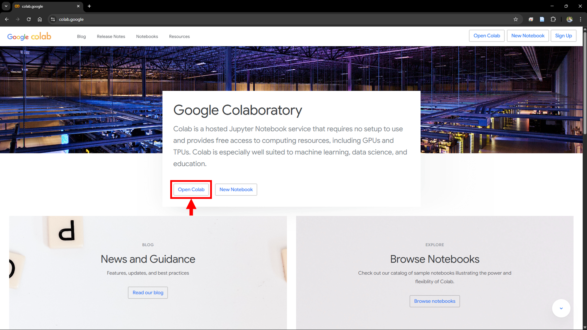
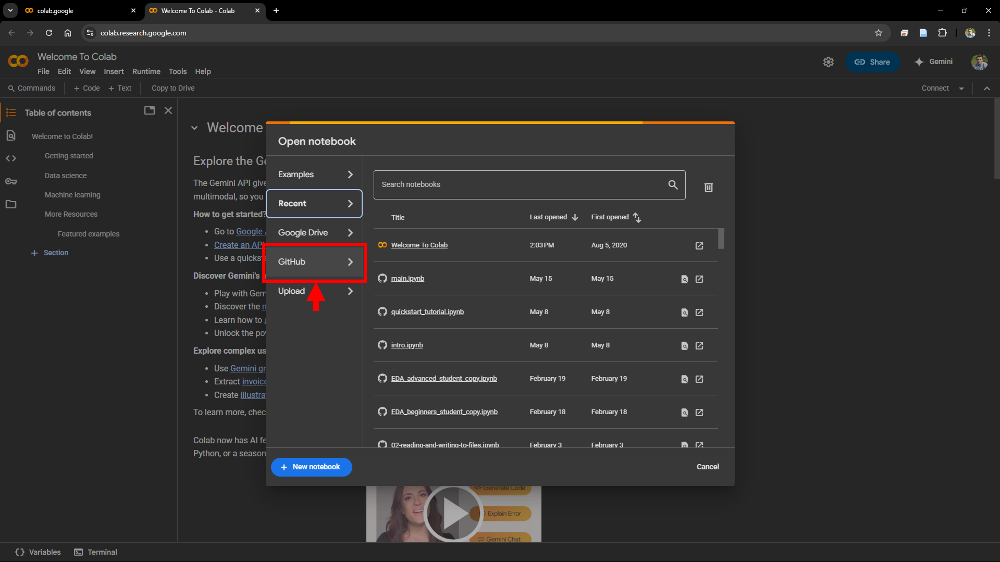
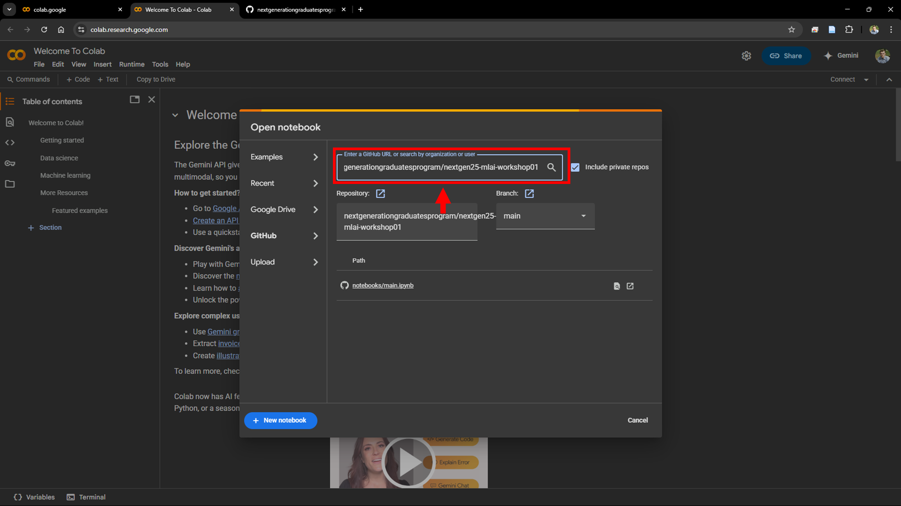
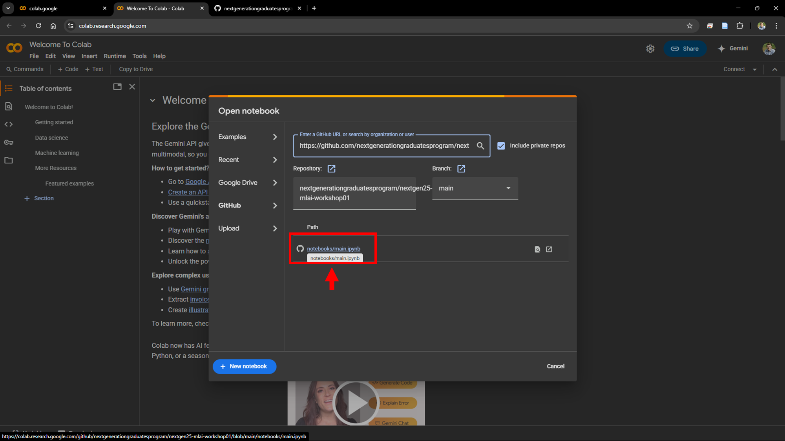

<h1>CSIRO NextGen25 Machine Learning Workshop #2</h1>

This workshop is design to give participants an introduction to **foundational, conceptual understanding of deep-learning** and how neural network architectures allow us to express complex and unknown functions. This workshop builds on the previous workshop to understand how we design flexible hypothesis spaces and optimize our models based on data.

<h2>:wrench: Setup</h2> 

Access the [Google Colab](https://colab.google/) website and open the colab service as shown below.

    

Open a notebook from a GitHub repository as shown below.

    

Paste the URL to the GitHub repository for this workshop ([NextGen25 MLAI Workshop 02](https://github.com/nextgenerationgraduatesprogram/nextgen25-mlai-workshop02)) in the search field as shown below.

    

Lastly, launch the notebook to get started!

    

